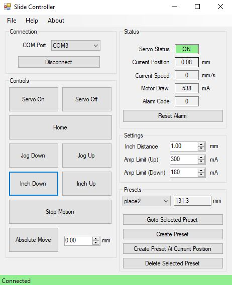

# <IAI-Slide-Driver>

## Description

The IAI Slide Driver aims to provide an intuitive and simple interface that controls PCON or SCON slides distributed by IAI America.
- Implements basic control functions like absolute move and incremental moves such as jogging and inching.
- Provides the user access to safety parameters such as amp limits in either direction.
- Displays status information such as position, speed, and motor draw.
- Handles errors thrown by the slide and is designed to halt when an error is detected.
- Automatically populates the COM Port drop down menu with COM ports detected by windows.
- Preset section where user can create a preset of the current position and return to the position through the preset.

The project tested my ability to convert between hexadecimal and decimal formats and working with registers.
Finally, I had to design queue loop for the serial communication to ensure that a read command and write command could never happen at the same time which would cause the slide to error.

## Usage

The following control commands are implemented:
- Connect/Disconnect to COM Port
- Set Servo Power
- Reset Alarm
- Home
- Inch Up
- Inch Down
- Jog Up
- Jog Down
- Stop Motion
- Absolute Move (Must be homed first!)
    

## Credits

This project uses the "EasyModbusDLL" library (V5.6) from the "EasyModbusTCP.NET" GitHub repository.\
Copyright (c) 2018-2020 Rossmann-Engineering. For more information, see [https://github.com/rossmann-engineering/EasyModbusTCP.NET](https://github.com/rossmann-engineering/EasyModbusTCP.NET).

This project takes snippets from the "IAI-Robotics-.NET-Drivers" GitHub repository owned by Dylan Morano.   
For more information, see https://github.com/dmmorano/IAI-Robotics-.NET-Drivers

## License

Copyright (c) 2023 Michael Cox - GNU General Public License - http://www.gnu.org/licenses/

---
